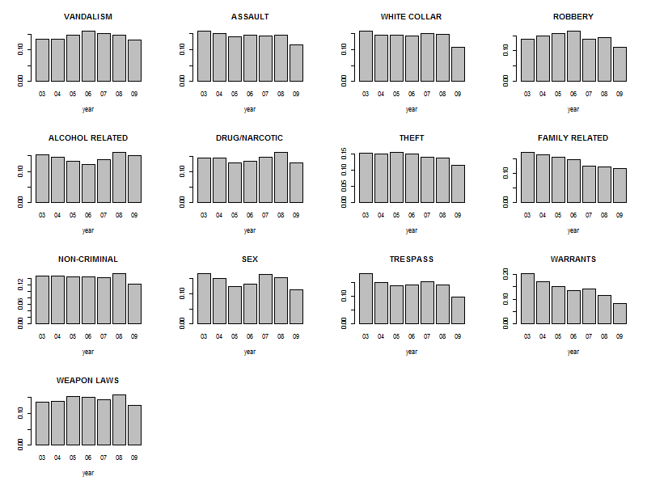

### San Francisco Crime Analysis

**By : Nadav Cohen**


#Overview
1. Background
2. Introduction to data set
3. Results 
  * Based on numbers
  * Based on geography
4. Things that didn't work
5. Other directions

#Introduction to data set

The data set has 976,731 records,
For each record we have the following columns:


As you can see from the table, some columns data was changed for the analysis, I will briefly get into the major changes:

Category:
One of the things that needed to change was the amount of categories in the data, as you can see from this figure:


There are allot of small categories that are very similar to one another, I merged some of them and created a bigger category:

```R
NON_CRIMINAL=c("NON-CRIMINAL","OTHER OFFENSES","RUNAWAY","RECOVERED VEHICLE","MISSING PERSON","SUICIDE","PORNOGRAPHY/OBSCENE MAT","SUSPICIOUS OCC","LOITERING")
  s_data$Category=plyr::mapvalues(x =s_data$Category,from = NON_CRIMINAL,to = rep("NON-CRIMINAL",length(NON_CRIMINAL)) )
  s_data$Category=plyr::mapvalues(x =s_data$Category,from = c("FORGERY/COUNTERFEITING", "FRAUD", "BAD CHECKS"),to=rep("FRAUD",3))
  s_data$Category=plyr::mapvalues(x =s_data$Category,from = c("BURGLARY", "ROBBERY", "STOLEN PROPERTY", "EXTORTION"),to=rep("ROBBERY",4))
  s_data$Category=plyr::mapvalues(x =s_data$Category,from = c("LARCENY/THEFT", "VEHICLE THEFT", "EMBEZZLEMENT"), to= rep("THEFT",3))
  s_data$Category=plyr::mapvalues(x =s_data$Category,from = c("VANDALISM", "ARSON"), to = rep("VANDALISM",2))
  s_data$Category=plyr::mapvalues(x =s_data$Category,from = c("DRIVING UNDER THE INFLUENCE", "DRUNKENNESS", "LIQUOR LAWS","DISORDERLY CONDUCT") , to = rep("ALCOHOL RELATED",4))
  s_data$Category=plyr::mapvalues(x =s_data$Category,from = c("SEX OFFENSES, FORCIBLE", "PROSTITUTION", "SEX OFFENSES, NON FORCIBLE" ), to = rep("SEX",3))
  s_data$Category=plyr::mapvalues(x =s_data$Category,from = c("KIDNAPPING","FAMILY OFFENSES") , to =  rep("FAMILY RELATED",2))
  s_data$Category=plyr::mapvalues(x =s_data$Category,from = c("BRIBERY","FRAUD","GAMBLING"), to = rep("WHITE COLLAR",3))
```
In total I merged 37 categories into 13:
WHITE COLLAR, WARRANTS, THEFT, DRUG/NARCOTIC, ALCOHOL RELATED, SEX, NON-CRIMINAL, ROBBERY, ASSAULT, TRESPASS, VANDALISM, WEAPON LAWS, FAMILY RELATED.

After the change the categories are now more robust and distinguished.


I would suggest SF police to rethink there categories because small categories can have a tendency to disappear and it would be better to have categories and sub-categories.

PdDistrict:
There are 10 police stations in SF:

some are more active then others:


There are crimes that do not have PdDistrict, this is because they are "out of town" or "unknown" we will discard them.

Time: 
From looking at different crimes and when they took place I saw that in general the "crime day" ends at around 5AM and then start again, as you can see from the figure:

thus I shifted 0:5 to 24:29, this can also help us with different regressions later.

It is strange that there is a peak in both 12AM and 12PM with a very high correlation between the category count of them together(0.98),
but I didn't find any bias that I could think of (looks like that over years and months) the peak is from the "white collar" but data looks fine and consistent. one though in mind is that this time is the default time then the exact time is unknown, and in less urgent tasks like "white collar" it happens more then other

#Basic functions
To make life easier and in the spirit of the company I created simple functions that enable you to create figures for this data set fast,
if you want to see distribution of one column or two, you can just write down the names of the columns and you will get a figure (barplot/heatmap) also you can change the scale of the count to log-space or frequency.
```R
#col_filter =  columns to be selected (like "Category" or c("Category","Time"))
#scale_change = (0 = no change);(1 = log space) (2 = Frequency)
#clust_dim_two = if you selected two columns do you want to cluster the second one?
#sortPlot = if you selecte only one column do you want the data to be sorted?
#filename = name of the figure file
generate_fig(s_data,cat_filter,scale_change=0,clust_dim_two=T,sortPlot=F,file_name=NULL)
```
Another function is for geographical exploration, here you can enter you desired category and the output will be all a grid on SF that each point will represent the number of crimes from that category, as the number of crimes rises the size and colour of the point changes from green to red.
```R
#map = map object of SF (loaded each time your source the R file)
#cat_filter = Category to be selected (like "THEFT")
#div_desc = if you want seperate figure for each Description (like T)
#filename = name of the figure file
show_on_geo_net(map,s_data,cat_filter,div_desc=F,filename)
```
Most figures here were created using this functions.

#Results
**Based on numbers:**
We will start with years and go up in resolution until hours,
Our first question is, is there a decline in crime over the year?
To answer this we first look of the crime count over the years

it looks like there is a gentle decline with a big one from 2008 to 2009, by looking at the year with the different months:

We can see that 2009 has missing months as July has no crimes and May also have a small number (2965 VS average of  8400)
In average there is 8,482 crimes each month in 2009, thus we can add the missing month crimes to the total in 2009 and we will ~ 101,784 crimes, this is only an approximation and not including the probably missing data in may.
Using chi-square test it's clear that there is dependences between crime and year.
Next I tried fitting the standard linear regression model for the number of crimes between 2003-2009 results with a significant trend of -2894 less crimes each year. The trend can be observed from the plot: 

The model significance vs. the use of the average (= not fitting a model) results with a p-value of 0.0075
That result should be taken with care though - standard regression model assumes the observations are independent samples from the same distribution, which is not the case here, as we have a time-series, where there is a dependency between the years.
Conclusion:
There is a decline in crime, but its not clear how strong it is, in next steps we will try to find the cause.
This is the data with the adding of crime to 2009, the blue line is the regression line:


Next I wanted to know is there is a change over crime type over the years:


From this heatmap of count of each crime in each year we can see that the general trend is kept each year with no significant change.
but lets look at the distribution of each crime over all years, maybe we can see trends there:

here we can see that there is a general decline in crime in 2009 (we discussed is earlier what this is due to the missing month), also 
there is a decline of warrants and "family related" over the years, but nothing much.
looking on each distribution separately didn't revel much more :

Conclusion:
It looks like the decline is mainly due to  warrants and "family related" and not more "hard crime"


After covering year trends we move to months, here is the distribution of months:

in general we see that there is fluctuations of crime over months but nothing major.
is there association of crime and month?

from looking on the heatmap it seems not, and the barplot looks the same:

Conclusion:
There is not clear association of crime and month

moving on to days:

There is no clear cut trend in the count of crimes over the different days

as we already come to understand, the majority of the crimes are theft and non-criminal and this is true on all days

here we are looking on the frequency on each crime over all days, and we can interesting things, it looks like we have 3 crime clusters:

	* this group (Weapon laws until white collar) are less chance to happen over the weekend.
	* this group (theft until alcohol related) is the opposite of the first group, with an increase over the weekend
	* sex is an outlier with a strong rise from Tue though Thur and low chance in other days
this is very cool and it makes sense except the sex crimes...
Conclusion:
The police should know what crimes to expect each day and build its force accordantly. 

Crime and hour in the day, we already touched upon the hour Issue


Is there an association of crime and time in the day?
Here is the different categories and there different hour distributions:

as we can see, most crimes take place from noom till the early night, crimes that are different are:

	* sex and vandalism are more from after noon till night
	* non-criminal, white collar and trespass take place in early morning till after noon

**Based on geography**

Is there a different geographical distribution for different crimes in the same  Category?


**K-Means**

Is there similar crime clusters across SF?


#Things that didn't work
1. KNN
2. Logistic regression

#Other directions
1. Bayesian network
2. Finding more biases in the data
3. Crossing with other DB (airbnb, poverty, health, temperature, court)