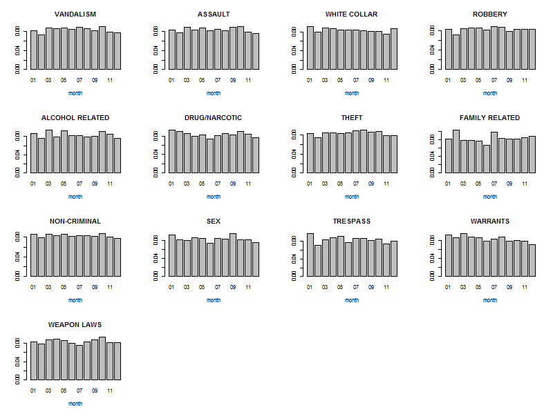
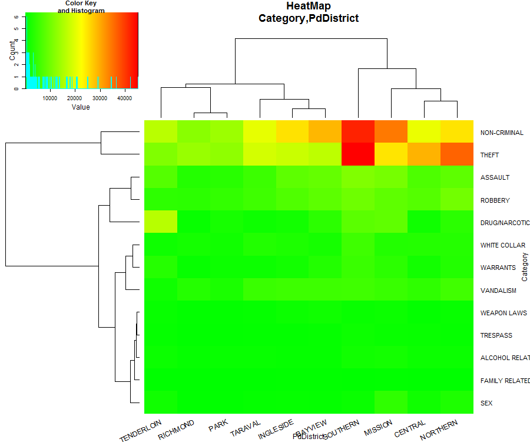
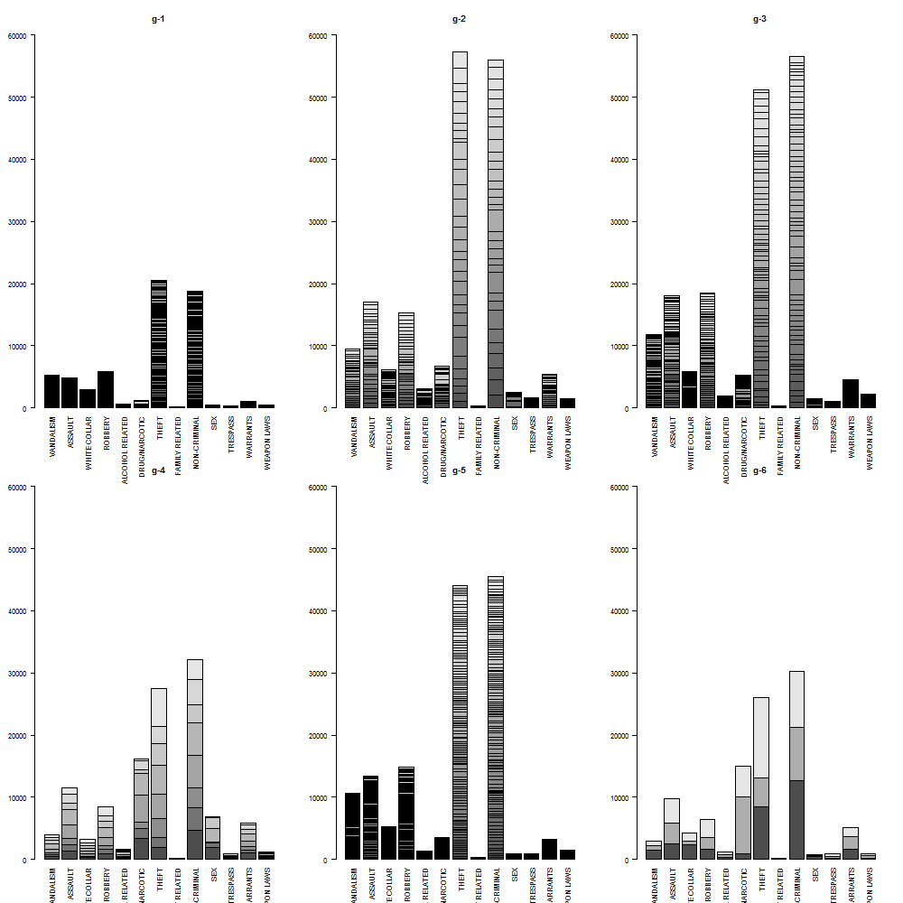

### San Francisco Crime Analysis

**By : Nadav Cohen**


#Overview
1. Background
2. Introduction to data set
3. Results 
  * Based on numbers
  * Based on geography
4. Things that didn't work
5. Other directions

#Introduction to data set

The data set has 976,731 records,
for each record we have the following columns:


As you can see from the table, some column data were changed for the analysis. I will briefly get into the major changes:

Category:
One of the things that needed to change was the amount of categories, as you can see from this figure:


There are a lot of small categories that are very similar to one another, I merged some of them into new categories:

```R
NON_CRIMINAL=c("NON-CRIMINAL","OTHER OFFENSES","RUNAWAY","RECOVERED VEHICLE","MISSING PERSON","SUICIDE","PORNOGRAPHY/OBSCENE MAT","SUSPICIOUS OCC","LOITERING")
  s_data$Category=plyr::mapvalues(x =s_data$Category,from = NON_CRIMINAL,to = rep("NON-CRIMINAL",length(NON_CRIMINAL)) )
  s_data$Category=plyr::mapvalues(x =s_data$Category,from = c("FORGERY/COUNTERFEITING", "FRAUD", "BAD CHECKS"),to=rep("FRAUD",3))
  s_data$Category=plyr::mapvalues(x =s_data$Category,from = c("BURGLARY", "ROBBERY", "STOLEN PROPERTY", "EXTORTION"),to=rep("ROBBERY",4))
  s_data$Category=plyr::mapvalues(x =s_data$Category,from = c("LARCENY/THEFT", "VEHICLE THEFT", "EMBEZZLEMENT"), to= rep("THEFT",3))
  s_data$Category=plyr::mapvalues(x =s_data$Category,from = c("VANDALISM", "ARSON"), to = rep("VANDALISM",2))
  s_data$Category=plyr::mapvalues(x =s_data$Category,from = c("DRIVING UNDER THE INFLUENCE", "DRUNKENNESS", "LIQUOR LAWS","DISORDERLY CONDUCT") , to = rep("ALCOHOL RELATED",4))
  s_data$Category=plyr::mapvalues(x =s_data$Category,from = c("SEX OFFENSES, FORCIBLE", "PROSTITUTION", "SEX OFFENSES, NON FORCIBLE" ), to = rep("SEX",3))
  s_data$Category=plyr::mapvalues(x =s_data$Category,from = c("KIDNAPPING","FAMILY OFFENSES") , to =  rep("FAMILY RELATED",2))
  s_data$Category=plyr::mapvalues(x =s_data$Category,from = c("BRIBERY","FRAUD","GAMBLING"), to = rep("WHITE COLLAR",3))
```
In total, I merged 37 categories into 13:
WHITE COLLAR, WARRANTS, THEFT, DRUG/NARCOTIC, ALCOHOL RELATED, SEX, NON-CRIMINAL, ROBBERY, ASSAULT, TRESPASS, VANDALISM, WEAPON LAWS, FAMILY RELATED.

After changes were made the categories are now more robust and distinguished.


I would suggest SF police rethink the defined crime categories since categories containing few incidents are not easily modelled. 

PdDistrict:
There are 10 police stations in SF:

some are more active then others:


There are records without PdDistrict association. This is because they are "out of town" or "unknown", meaning they are located outside of SF. They will be discarded.

Time: 
From looking at different crimes and their time of occurrence, it seems that most crimes are committed at around 6PM with lower rates at around 5AM. Taking a histogram of the data we can see that, as time is a continuous measure, plotting the entire 24-hour time frame beginning at 5AM, time of occurrence of crimes is approximately normally distributed around 6PM. Thus, I converted 0:5 to 24:29, as follows:


 
It is noticeable that there is a peak at both 12AM and 12PM with a very high correlation between the category count at both hours(0.98). This phenomena occurs during each month and year throughout the data. 
I didn't find any bias that I could think of that would explain this phenomena. Apparently the peak is caused mainly by "White Collar" crimes but no explanatory feature could be found in the data. Two thoughts that come to mind are that either these times are the default times for the day and night shifts when the exact time is unknown, or that less urgent crimes such as "White Collar" are collectively reported at these hours. 
Because we don't understand it fully, we won't discard these records.

#Basic functions
To make life easier and in the spirit of the company I created a few simple functions that enable creating figures for this data set quickly.
If you want to see distribution of one feature by itself or two features together, you can just write down the names of the columns and you will get a figure (barplot/heatmap). You can also change the scale of the count to log-space (transformation) or proportions, and in a two dimension analysis hierarchical clustering will be done on one of the features or both.
```R
#col_filter =  columns to be selected (like "Category" or c("Category","Time"))
#scale_change = (0 = no change);(1 = log space) (2 = Proportion)
#clust_dim_two = if you selected two columns do you want to cluster the second one?
#sortPlot = if you selected only one column do you want the data to be sorted?
#filename = name of the figure file
generate_fig(s_data,cat_filter,scale_change=0,clust_dim_two=T,sortPlot=F,file_name=NULL)
```
Another function is for geographical exploration. Here you can enter a desired category and the output will be displayed on a map grid of SF where each point will represent the amount of crimes from that category. As the amount of crimes rises, the size and colour of the point changes from green to red. All calculations were done in log space.
```R
#map = map object of SF (loaded each time your source the R file)
#cat_filter = category to be selected (like "THEFT")
#div_desc = if you want separate figures for each description (like T)
#filename = name of the figure file
show_on_geo_net(map,s_data,cat_filter,div_desc=F,filename)
```
Most figures here were created using these functions.

#Results
**Based on numbers:**
We will start with years and go up in resolution up to hours.
Our first question is, whether there is a decline in crime over the years?
To answer this, we first look at the crime count over the years:

It seems that there is a slight decline throughout 2003-2008 with a major one from 2008 to 2009. However, taking a closer look at the different months throughout the data period:

We can infer that 2009 has missing data as June has no crime records and there are very few crime records during May (2965 VS average of  8400).
Disregarding these two months, the monthly crime average in 2009 is 8,482. Replacing the crime amounts in May and June with the calculated average and totalling the new 2009 yearly crime amount we get 101,784 crimes. This is only an estimation of the yearly crime rate. 
Using chi-square test it's clear that there is a significant dependence between crime and year.
Next I tried fitting the standard linear regression model for the amount of crimes between 2003-2009 results with a significant trend of -2894 less crimes each year. The trend can be observed from the plot: 

This result should be taken with care though - standard regression modelling assumes the observations are independent samples from the same distribution, which is not the case here, as we have a time-series, where there is a dependency between the years.
Conclusion:
There is a decline in crime, but it's not clear how significant it is. In the next steps we will try to find the cause.
Following, is the model plot after replacing the crime rate in 2009 as mentioned above. The blue line is the regression line:


Next I wanted to know if there is a change of crime type proportions over the years:


From this heatmap depicting the amount of each crime type in each year, we can see that the amount figures are kept each year with no significant change.
Lets look at the distribution of each crime over all years, maybe we can identify trends there:

Here we can see that there is a general decline in crime amounts in 2009 (as discussed earlier) vis-a-vis earlier years, also 
there is a decline of warrants and "family related" crimes over the years.
Looking at each distribution separately didn't revel much more:

Conclusion:
It looks like the decline is mainly due to warrants and "family related" crimes and not worse crimes.


After covering year trends we move on to months. Following is the crime rate distribution in each month:

We can see that there are fluctuations, albeit not significant, of crime rates over months.
Is there an association between crime and month?

By looking at the heatmap it seems not, and the barplot shows similar results:

Conclusion:
There seems to be no clear association between crime and month.

Moving on to days:

There is no clear-cut trend in the amount of crimes over the different days of the week.

As we have already come to understand, the majority of crime types are "Theft" and "Non-Criminal". This is true for all days.

Here we are looking at the frequency of each crime type over each day of the week. It seems that there are 3 crime clusters:

1. "Weapon laws" to "White collar" seem less likely to happen over the weekend.
2. "Theft" to "Alcohol related" shows a generally opposite trend in regards to the first group, with an increase over the weekend.
3. "Sex" is an outlier with a significantly higher rate from Tuesday to Friday and lower rates on weekends and Mondays.

Conclusion:
The police should know what crimes to expect each day and build its force accordantly. 

Crime and hour in the day, we already touched upon the hour Issue


Is there an association of crime and time in the day?
Here is the different categories and there different hour distributions:

as we can see, most crimes take place from noom till the early night, crimes that are different are:

1. sex and vandalism are more from after noon till night
2. non-criminal, white collar and trespass take place in early morning till after noon

I will conclude the segment will other things about association of crime category and other parameters:

As we can see and already know, theft and non-criminal are the majority of police business. this is true for all stations and in particular  to the most active ones southern are mission, with oner expectation of drugs and tenderloin station.
If we look at the frequency of crime over the stations:

we see that most sex crimes are handled by mission station, and this is also the case with drugs and tenderloin station although mission and southern  are also very active.
beyview and ingleside deal more with weapon laws and family issues then others.

Another final thing that I tried to do is to find out if I can predict if a crime had a resolution, to do that I used bagging,
and got 88% accuracy, I didn't have time to investigate that feature help to achieve this results 

**Based on geography**
One thing that was interesting to me is what can I learn from the geographical of crime.
I build a grid of points all across SF and associated each crime to the nearest point to him, fox example:


Here are all the crimes on the grid:


as you can see, most crime takes place in the northern east of the city, this is known to be the more active side of the city:


I broke categories to there different descriptions to see if I get different geographical picture and I got nice results:
here you can see cocaine distribution:

And here marijuana:

You clearly see that cocaine use is in a specific location and this is opposite to marijuana that is more "all over the place"
another example is robbery:

While in general robbery is all across SF, you can see that some types of robberies are more common in specific locations

VS


Distance from police stations:
Another interesting thing I came across was a negative correlation between number of crimes that a station took care of and the distance, meaning that there might be a tendency for the station police man to work closer to the station.
I calculated this be calculating the euclidean distance on each crime and the location of it's police station. and counted in number of crimes in each distance (~100M)
cor:

**K-Means**
To conclude my work I asked Is there similar crime clusters across SF?
you answer that I counted the number of crimes in each point and tried to cluster it using k-mean
each point have a vector of all crimes that took place inside, and run the k-means twice:
once of raw count:

here you can see each cluster crime distribution:

and another of frequency in the point :

here you can see each cluster crime distribution:

The results in general are very similar.

#Things that didn't work
1. KNN
2. Logistic regression

#Other directions
1. Bayesian network
2. Finding more biases in the data
3. Crossing with other DB (airbnb, poverty, health, temperature, court)