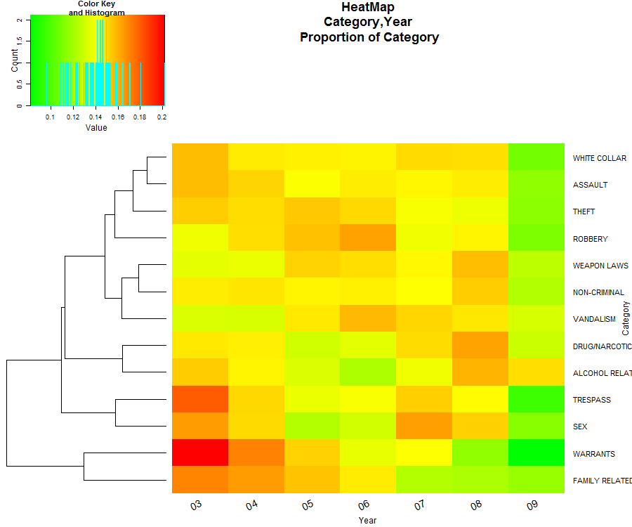
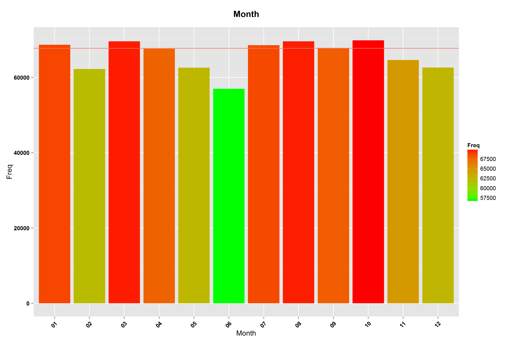

### San Francisco Crime Analysis

**By : Nadav Cohen**


#Overview
1. Background
2. Introduction to data set
3. Results 
  * Based on numbers
  * Based on geography
4. Other directions

#Introduction to data set

The data set have 976,731 records,
For each record we have the following columns:


As you can see in the table, some columns data was changed for the analysis, I will briefly get into the major changes:

Category:
One of the things that needed to change was the amount of categories in the data, as you can see from this figure:


There are allot of small categories that are very similar to one another, I merged some of them and created a bigger category:

```R
NON_CRIMINAL=c("NON-CRIMINAL","OTHER OFFENSES","RUNAWAY","RECOVERED VEHICLE","MISSING PERSON","SUICIDE","PORNOGRAPHY/OBSCENE MAT","SUSPICIOUS OCC","LOITERING")
  s_data$Category=plyr::mapvalues(x =s_data$Category,from = NON_CRIMINAL,to = rep("NON-CRIMINAL",length(NON_CRIMINAL)) )
  s_data$Category=plyr::mapvalues(x =s_data$Category,from = c("FORGERY/COUNTERFEITING", "FRAUD", "BAD CHECKS"),to=rep("FRAUD",3))
  s_data$Category=plyr::mapvalues(x =s_data$Category,from = c("BURGLARY", "ROBBERY", "STOLEN PROPERTY", "EXTORTION"),to=rep("ROBBERY",4))
  s_data$Category=plyr::mapvalues(x =s_data$Category,from = c("LARCENY/THEFT", "VEHICLE THEFT", "EMBEZZLEMENT"), to= rep("THEFT",3))
  s_data$Category=plyr::mapvalues(x =s_data$Category,from = c("VANDALISM", "ARSON"), to = rep("VANDALISM",2))
  s_data$Category=plyr::mapvalues(x =s_data$Category,from = c("DRIVING UNDER THE INFLUENCE", "DRUNKENNESS", "LIQUOR LAWS","DISORDERLY CONDUCT") , to = rep("ALCOHOL RELATED",4))
  s_data$Category=plyr::mapvalues(x =s_data$Category,from = c("SEX OFFENSES, FORCIBLE", "PROSTITUTION", "SEX OFFENSES, NON FORCIBLE" ), to = rep("SEX",3))
  s_data$Category=plyr::mapvalues(x =s_data$Category,from = c("KIDNAPPING","FAMILY OFFENSES") , to =  rep("FAMILY RELATED",2))
  s_data$Category=plyr::mapvalues(x =s_data$Category,from = c("BRIBERY","FRAUD","GAMBLING"), to = rep("WHITE COLLAR",3))
```
In total I merged 37 categories into 13
WHITE COLLAR, WARRANTS, THEFT, DRUG/NARCOTIC, ALCOHOL RELATED, SEX, NON-CRIMINAL, ROBBERY, ASSAULT, TRESPASS, VANDALISM, WEAPON LAWS, FAMILY RELATED.

After the change the categories are now more robust and distinguished.


PdDistrict:
There are 10 police stations in SF:

some are more active then others:


Time: From looking are different crimes and when they took place I saw that in general the "crime day" ends at around 5AM and then start again, as you can see from the figure:


It is strange that there is a peak in both 12AM and 12PM with a very high correlation between the category count of them together(0.98),
but I didn't find any bias that I could think of (looks like that over years and months) the peak is from the "white collar" but data looks fine and consistent.


#Basic functions
To make life easier and in the spirit of the company I created simple functions that enable you to create figures for this data set fast,
if you want to see distribution of one column or two, you can just write down the names of the columns and you will get a figure (barplot/heatmap) also you can change the scale of the count to log-space or frequency.
```R
#col_filter =  columns to be selected (like "Category" or c("Category","Time"))
#scale_change = (0 = no change);(1 = log space) (2 = Frequency)
#clust_dim_two = if you selected two columns do you want to cluster the second one?
#sortPlot = if you selecte only one column do you want the data to be sorted?
#filename = name of the figure file
generate_fig(s_data,cat_filter,scale_change=0,clust_dim_two=T,sortPlot=F,file_name=NULL)
```
Another function is for geographical exploration, here you can enter you desired category and the output will be all a grid on SF that each point will represent the number of crimes from that category, as the number of crimes rises the size and colour of the point changes from green to red.
```R
#map = map object of SF (loaded each time your source the R file)
#cat_filter = Category to be selected (like "THEFT")
#div_desc = if you want seperate figure for each Description (like T)
#filename = name of the figure file
show_on_geo_net(map,s_data,cat_filter,div_desc=F,filename)
```

#Results
**Based on numbers**

(one month in 09 is missing)







Different Categories have different hour distributions


**Based on geography**


**K-Means**


#Things that didn't work
1. KNN
2. Logistic regression

#Other directions
1. Bayesian network
2. Finding more biases in the data
3. Crossing with other DB (airbnb, poverty, health, temperature, court)