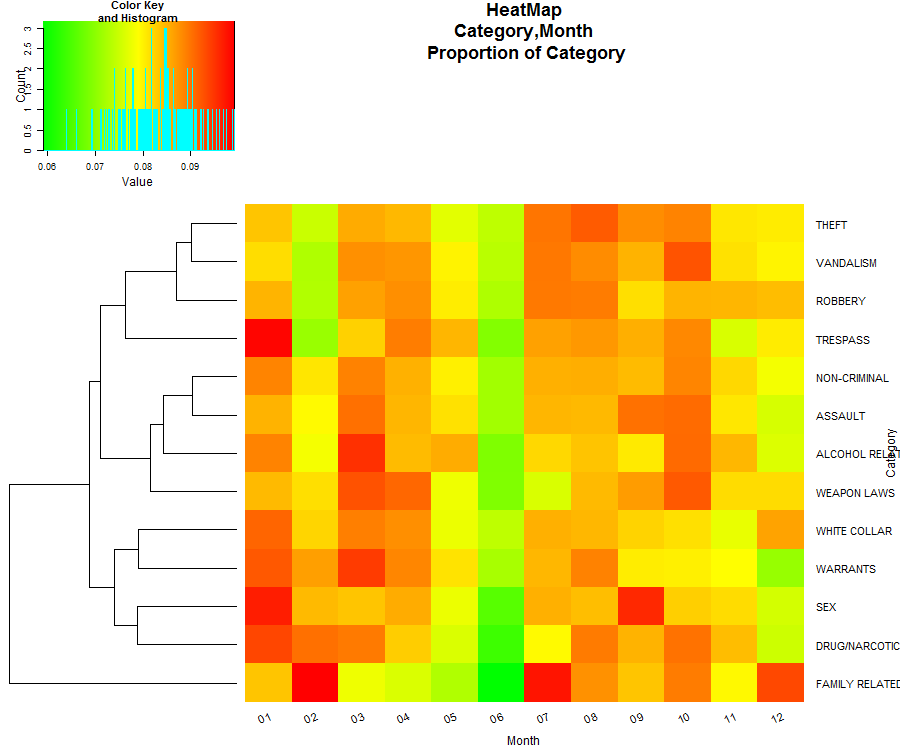
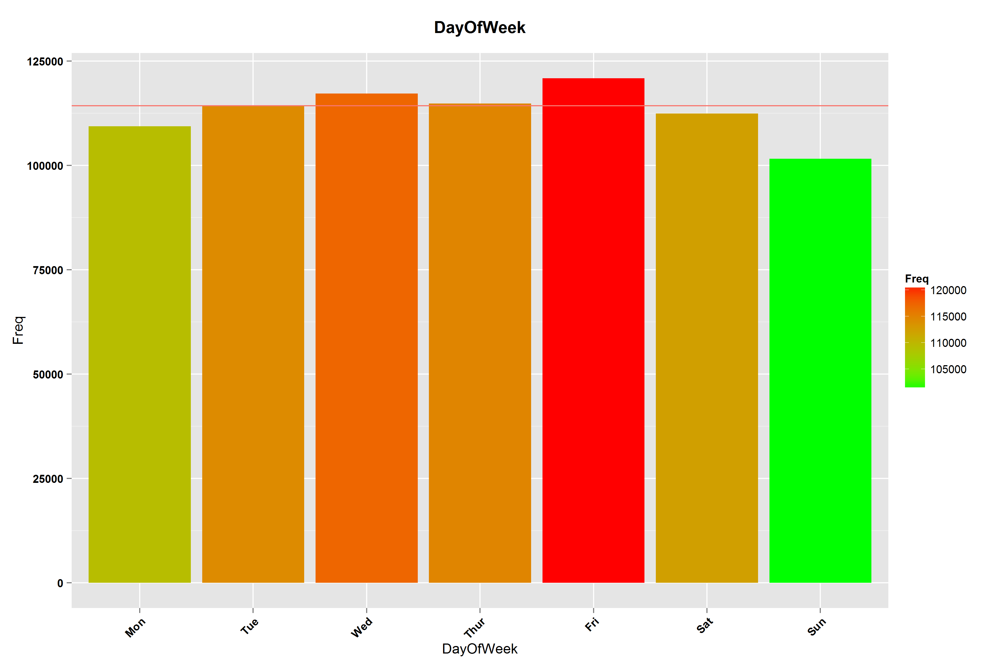
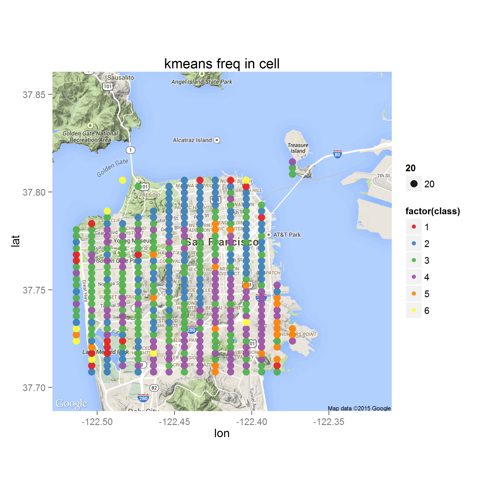

### San Francisco Crime Analysis

**By : Nadav Cohen**


#Overview
1. Introduction to data set
2. Data Analysis 
  * Based on numbers
  * Based on geography
3. Other directions

#Introduction to data set

The data set has 976,731 police records gathered between 2003-2009 of different crimes in SF, starting from robbery and theft, up to loitering. 
Each record contains description of the offence, time, location & neighbourhood and resolution. The full data structure is described in the following table:


During the preprocessing, some column data were changed in order to support the analysis. Briefly describing the major changes are:

**Category:**
One of the things that needed to change was the amount of categories. Some categories are quite uncommon, as you can see from this figure:


Since there are a lot of small categories that are very similar to one another, the similar categories has been consolidated into new categories:

```R
NON_CRIMINAL=c("NON-CRIMINAL","OTHER OFFENSES","RUNAWAY","RECOVERED VEHICLE","MISSING PERSON","SUICIDE","PORNOGRAPHY/OBSCENE MAT","SUSPICIOUS OCC","LOITERING")
  s_data$Category=plyr::mapvalues(x =s_data$Category,from = NON_CRIMINAL,to = rep("NON-CRIMINAL",length(NON_CRIMINAL)) )
  s_data$Category=plyr::mapvalues(x =s_data$Category,from = c("FORGERY/COUNTERFEITING", "FRAUD", "BAD CHECKS"),to=rep("FRAUD",3))
  s_data$Category=plyr::mapvalues(x =s_data$Category,from = c("BURGLARY", "ROBBERY", "STOLEN PROPERTY", "EXTORTION"),to=rep("ROBBERY",4))
  s_data$Category=plyr::mapvalues(x =s_data$Category,from = c("LARCENY/THEFT", "VEHICLE THEFT", "EMBEZZLEMENT"), to= rep("THEFT",3))
  s_data$Category=plyr::mapvalues(x =s_data$Category,from = c("VANDALISM", "ARSON"), to = rep("VANDALISM",2))
  s_data$Category=plyr::mapvalues(x =s_data$Category,from = c("DRIVING UNDER THE INFLUENCE", "DRUNKENNESS", "LIQUOR LAWS","DISORDERLY CONDUCT") , to = rep("ALCOHOL RELATED",4))
  s_data$Category=plyr::mapvalues(x =s_data$Category,from = c("SEX OFFENSES, FORCIBLE", "PROSTITUTION", "SEX OFFENSES, NON FORCIBLE" ), to = rep("SEX",3))
  s_data$Category=plyr::mapvalues(x =s_data$Category,from = c("KIDNAPPING","FAMILY OFFENSES") , to =  rep("FAMILY RELATED",2))
  s_data$Category=plyr::mapvalues(x =s_data$Category,from = c("BRIBERY","FRAUD","GAMBLING"), to = rep("WHITE COLLAR",3))
```
In total, 37 categories were merged into 13 distinctive ones:
WHITE COLLAR, WARRANTS, THEFT, DRUG/NARCOTIC, ALCOHOL RELATED, SEX, NON-CRIMINAL, ROBBERY, ASSAULT, TRESPASS, VANDALISM, WEAPON LAWS, FAMILY RELATED.

This has resulted with a more robust and distinguished definition of crimes.


I would suggest SF police rethink the defined crime categories since categories containing few incidents are not easily modelled, and those crimes can be expressed in the subcategory variable. 

**PdDistrict:**
There are 10 police stations in SF:

some are more active then others:


There are records without PdDistrict association. This is because they are "out of town" or "unknown", meaning they are located outside of SF. They will be discarded.

**Time:**
From looking at different crimes and their time of occurrence, it seems that most crimes are committed at around 6PM with lower rates at around 5AM. Taking a histogram of the data we can see that, as time is a continuous measure, plotting the entire 24-hour time frame beginning at 5AM, time of occurrence of crimes is approximately normally distributed around 6PM. Thus, I converted 0:5 to 24:29, as follows:


The following heatmap represents the proportions of the crimes with respect to the time of the day:
 
For example, "White collar" crimes has a noticeable peak (expressed by strong red colour) both at 12AM and 12PM with a very high correlation between the category count during both hours(0.98). Although it is strange that white collar crimes are frequent at midnight, a close examination to locate the regions of the phenomena demonstrates that it is consistent in every month and a year throughout the data, without reasonable events causing bias. 
There are two possible guesses to the phenomena origins - either these times are the default times for the day and night shifts when the exact time is unknown, or that less urgent crimes such as "White Collar" are collectively reported at these hours. At any case, this is likely to be one of the causes that the total number of crimes, per hour (previous graph), has peaks at 12AM and 12PM. 
Because we don't understand it fully, we won't discard these records.

#Basic functions
To make life easier and in the spirit of the company I created a few simple functions that enable creating figures for this data set quickly.
If you want to see distribution of one feature by itself or two features together, you can just write down the names of the columns and you will get a figure (barplot/heatmap). You can also change the scale of the count to log-space (transformation) or proportions, and in a two dimension analysis hierarchical clustering will be done on one of the features or both.
```R
#col_filter =  columns to be selected (like "Category" or c("Category","Time"))
#scale_change = (0 = no change);(1 = log space) (2 = Proportion)
#clust_dim_two = if you selected two columns do you want to cluster the second one?
#sortPlot = if you selected only one column do you want the data to be sorted?
#filename = name of the figure file
generate_fig(s_data,cat_filter,scale_change=0,clust_dim_two=T,sortPlot=F,file_name=NULL)
```
Another function is for geographical exploration. Here you can enter a desired category and the output will be displayed on a map grid of SF where each point will represent the amount of crimes from that category. As the amount of crimes rises, the size and colour of the point changes from green to red. All calculations were done in log space.
```R
#map = map object of SF (loaded each time your source the R file)
#cat_filter = category to be selected (like "THEFT")
#div_desc = if you want separate figures for each description (like T)
#filename = name of the figure file
show_on_geo_net(map,s_data,cat_filter,div_desc=F,filename)
```
Most of the figures in the analysis were created using these functions.

#Data Analysis
**Based on numbers:**
We will start with years and go up in resolution up to hours.
Our first question is, whether there is a decline in crime over the years?
To answer this, we first look at the crime count over the years:

It seems that there is a slight decline throughout 2003-2008 with a major one from 2008 to 2009. However, taking a closer look at the different months throughout the data period:

We can infer that 2009 has missing data as June has no crime records and there are very few crime records during May (2965 VS average of  8400).
Disregarding these two months, the monthly crime average in 2009 is 8,482. Replacing the crime amounts in May and June with the calculated average and totalling the new 2009 yearly crime amount we get 101,784 crimes. This is only an estimation of the yearly crime rate. 
Using chi-square test it's clear that there is a significant dependence between crime and year.
Next I tried fitting the standard linear regression model for the amount of crimes between 2003-2009 results with a significant trend of -2894 less crimes each year. The trend can be observed from the plot: 

This result should be taken with care though - standard regression modelling assumes the observations are independent samples from the same distribution, which is not the case here, as we have a time-series, where there is a dependency between the years.
Conclusion:
There is a decline in crime, but it's not clear how significant it is. In the next steps we will try to find the cause.
Following, is the model plot after replacing the crime rate in 2009 as mentioned above. The blue line is the regression line:


Next I wanted to know if there is a change of crime type proportions over the years:


From this heatmap depicting the amount of each crime type in each year, we can see that the amount figures are kept each year with no significant change.
Lets look at the distribution of each crime over all years, maybe we can identify trends there:

Here we can see that there is a general decline in crime amounts in 2009 (as discussed earlier) vis-a-vis earlier years, also 
there is a decline of warrants and "family related" crimes over the years.
Looking at each distribution separately didn't revel much more:

Conclusion:
It looks like the decline is mainly due to warrants and "family related" crimes and not worse crimes.


After covering year trends we move on to months. Following is the crime rate distribution in each month:

We can see that there are fluctuations, albeit not significant, of crime rates over months.
Is there an association between crime and month?

By looking at the heatmap it seems not, and the barplot shows similar results:

Conclusion:
There seems to be no clear association between crime and month.

Moving on to days:

There is no clear-cut trend in the amount of crimes over the different days of the week.

As we have already come to understand, the majority of crime types are "Theft" and "Non-Criminal". This is true for all days.

Here we are looking at the frequency of each crime type over each day of the week. It seems that there are 3 crime clusters:

1. "Weapon laws" to "White collar" seem less likely to happen over the weekend.
2. "Theft" to "Alcohol related" shows a generally opposite trend in regards to the first group, with an increase over the weekend.
3. "Sex" is an outlier with a significantly higher rate from Tuesday to Friday and lower rates on weekends and Mondays.

Conclusion:
Each group of crimes has a unique pattern and therefore can be monitored accordingly. 

Crime and hour during the day, is discussed above.


Is there an association between crime and time during the day?
Following, is a distribution plot of the different crime categories and hours:

As we can see, most crimes take place from noon till the early hours of the night. Crimes with different patterns are:

1. Sex crimes and vandalism occur more frequently from late noon till night time.
2. Non-criminal, white collar and trespassing take place more frequently during the early morning till the afternoon.

I will conclude this segment by associating crime categories with other parameters:

As we can see and already know, theft and non-criminal are occupy the majority of police activities. This is true for all stations and in particular to the most active ones: Southern and Mission, with one expectation of drugs and Tenderloin station.
If we look at the proportion of crime categories per station:

We see that most sex crimes are handled by Mission station, and this is also the case with drugs in Tenderloin station, although Mission and Southern  are also very active.
Bayview and Ingleside deal more frequently with weapon laws and family issues then other stations.

In a optimal scenario, the police efforts and resources would be invested into solving crimes which will be resolved. Therefore the resolution variables was transferred into binary variable, where False indicate that the crime has not been resolved. 
A bagging classification algorithm has learned the data, and got 88% accuracy over the test set. That number seemed suspiciously high, therefore a close study of the resolved proportions per crime category was done.
 
As it turns out, some of the categories are extremely likely to be resolved (such as warrants with 0.92 resolve rate), and some are not likely at all (such as theft with 0.06 resolve rate). This has led to a good classification algorithm. 


**Based on geography**

One thing that was interesting is whether spatial data can be useful to infer on the different crimes.
I have built a grid of points all across SF and associated each crime to the nearest geographical point of occurrence, for example:


Following is a plot of all the crimes on the grid:


As we can see, most crimes take place in the northern east of the city. This is known to be the more active part of the city:


I broke categories to three different descriptions to see if I get different geographical results. 
Cocaine distribution:

Marijuana distribution:

We clearly see that cocaine use is more common in a specific location in contrast to marijuana that is more "all over the place".
Another example is robbery:

While in general robbery occurs all across SF, we can see that some types of robberies are more common in specific locations:

VS


**Distance from police stations:**
Another interesting thing I came across is a positive correlation between the amount of crimes that a station handled and the distance, meaning that there might be a tendency for the station police officers to work closer to the station.
I calculated this by the euclidean distance of each crime from the location of the relevant police station, and allotted them to bins of distances (~100M per bin).
Although the correlations are positive, they are fairly weak and so cannot be used for inference.

**K-nearest neighbours**
An unsuccessful attempt was done to use nearest neighbours in order to predict the crime type based on the location. It was unsuccessful, because there are some locations, which literately has thousands of crimes exactly at the same GPS location. 
This prevent a reasonable use of nearest neighbours - but also raises another question. In one point there were more than 12k crimes reported between 2006-2009, on a average of roughly 10 crimes per day. 
It seems reasonable for the police to patrol those locations more than often than the usual. 

**K-Means**
To conclude my work I asked if there are crime clusters across geographic locations SF?
To answer that, I used the division of SF map into bins (~100M), and counted the number of crimes in each bin. The distribution of crimes at the been was considered a vector in R^13, and k-mean algorithm was used to cluster the bins.
The motivation is that points with higher counts of crimes will be closer to each other (because of the structure of the L2 norm), while we also address the different distribution of crimes in each bin. 
After running the k-means, this is the clustering of crime that I got according to proportion of crime in the point :

Here we can see each cluster crime distribution:

The results in general are very similar.
We can clearly see that some crime types are more common in certain cluster groups than others.

#Other directions
1. Bayesian network
2. Finding more biases in the data
3. Crossing with other DBs (airbnb, poverty, health, temperature, court)